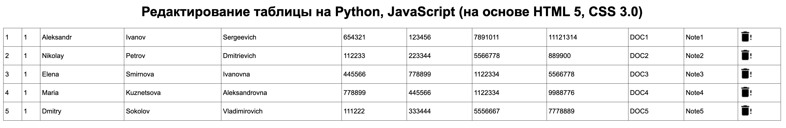
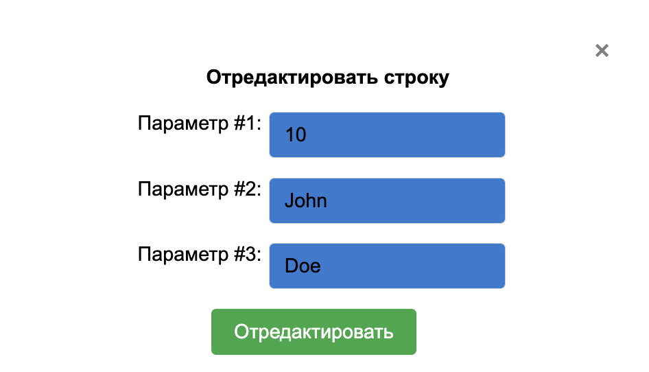
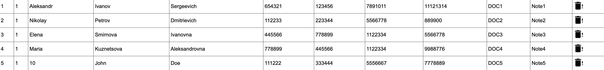
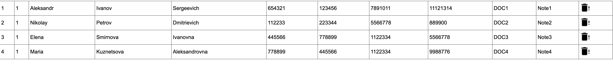

# Лабораторная работа №1

## Исправить код для Python для корректной работы базы данных в веб-приложении.

### Веб-приложение построено на Python-фреймворке Flask и использует MariaDB для хранения данных. База данных запускается с помощью Docker Compose.

### Пример работы

