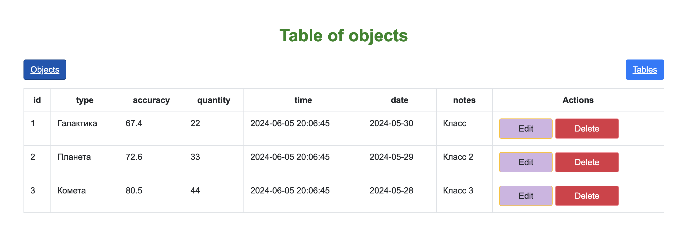
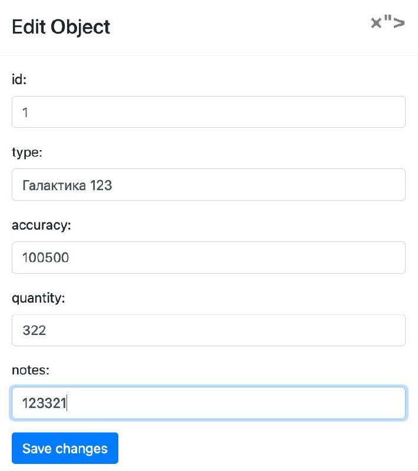
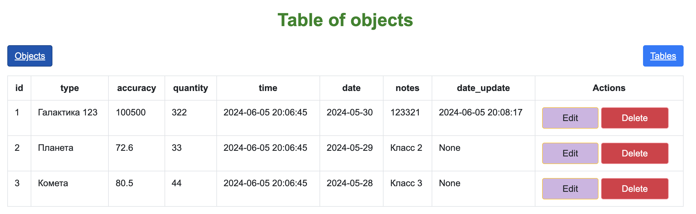
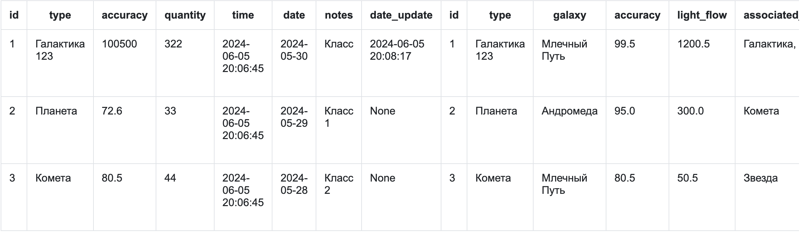

# Лабораторная работа №2

## Создать схему баз данных, разработать триггер, процедуру и исправить код для Python для корректной работы базы данных в веб-приложении.

### Веб-приложение использует MariaDB как базу данных, запускаемую с помощью Docker Compose. Разработанное на Python-фреймворке Flask, приложение было значительно отредактировано и улучшено по сравнению с первоначальной версией.я

### Пример работы
  
1. Проверка триггера

2. Таблицы полученные с помощью процедуры получения двух таблиц
